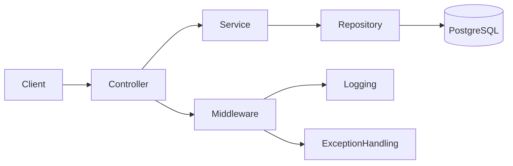
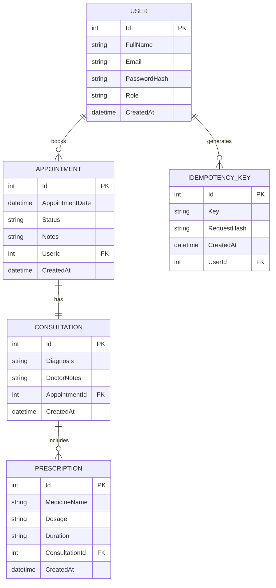
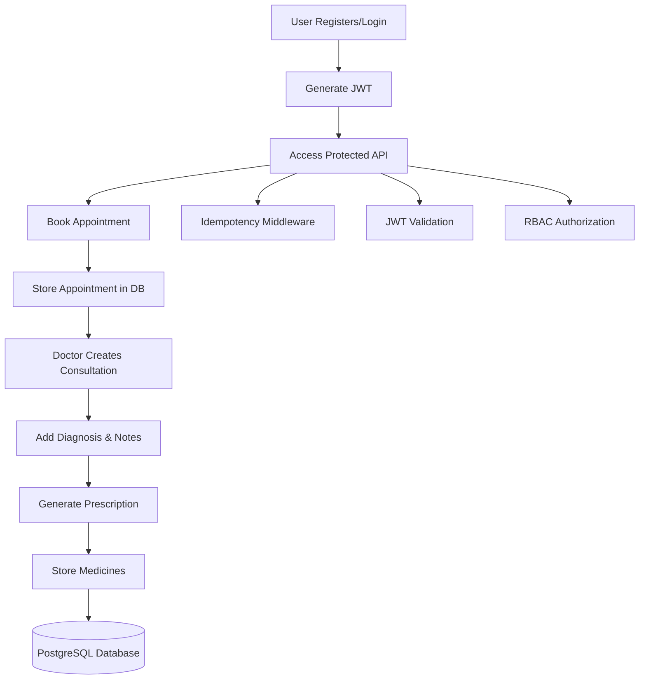

# 🏥 Appointment Booking API

A production-ready ASP.NET Core Web API for managing appointment bookings with authentication, RBAC, Docker support, CI pipeline, and observability.

## 🚀 Tech Stack

- ASP.NET Core 8
- Entity Framework Core
- PostgreSQL
- JWT Authentication
- BCrypt Password Hashing
- 

- Docker & Docker Compose
- GitHub Actions CI
- Swagger (OpenAPI)

- ## ✨ Features

- User Registration & Login
- JWT Authentication
- 

- Role-Based Access Control (Doctor/Patient)
- 

- Appointment CRUD Operations
- Idempotency Support
- 

- Rate Limiting
- Health Check Endpoint
- Structured Logging
- Dockerized Setup
- CI Pipeline

## 🏗 Clean Architecture Overview

## 🗄️ Entity Relationship Diagram

## 🔄 Application Flow

## ⚙️ Local Setup

### 1️⃣ Clone Repository

git clone https://github.com/poornimajoshi90/appointment-booking-api.git

cd appointment-booking-api

## 🚀 API Running Information

API runs at:

http://localhost:8080

Swagger UI:

http://localhost:8080/swagger/index.html

## 🔐 Environment Variables

- ConnectionStrings__DefaultConnection
- JWT__Key
- JWT__Issuer
- JWT__Audience

## 📖 API Documentation

Swagger UI available at:
/swagger

OpenAPI schema included.

## 🔄 CI Pipeline

GitHub Actions pipeline includes:

- Build
- Restore
- Run Tests
- Docker Build

## 📊 Observability

- Health Check Endpoint: /health
- Structured Logging
- Correlation ID support

## 🔐 Security Measures

- BCrypt Password Hashing
- JWT Expiry
- Role-Based Access Control
- Idempotency Keys
- Rate Limiting
- HTTPS Required
- Secrets via Environment Variables
- SQL Injection Protection (EF Core)
- OWASP Best Practices

